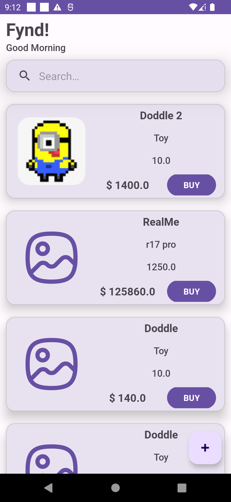
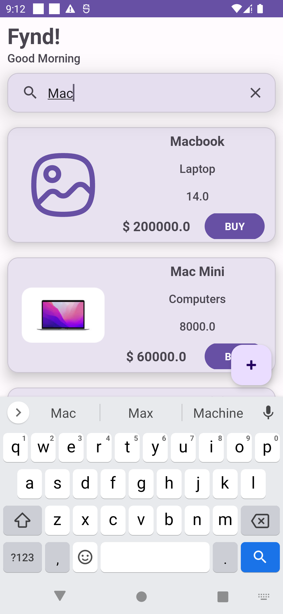
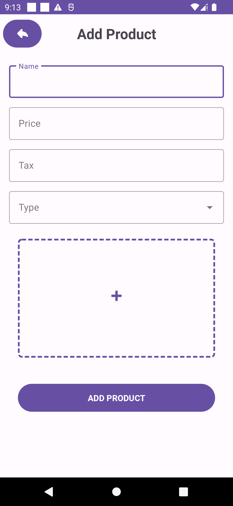

<h2 align="center">
Fynd
</h2>

<h4 align="center">
    Developed using MVVM and Material theme.
</h4>
<h4 align="center">
    App contains home screen with product list and search feature.
</h4>
<h4 align="center">
    App contains add product screen with product list.
</h4>
<h4 align="center">
    Used retrofit for accessing API.
</h4>

<h3 align="center">
Simple product listing app with MVVM and Material theme
</h3>

<h4 align="center">
Available for Android.
</h4>

 

## Demo

<h4 align="center">
Home Screen
</h4>

   

<h4 align="center">
Search Screen
</h4>

   

<h4 align="center">
Add Product Screen
</h4>

   

## Build steps

In the toolbar Build ->  Build Bundle(s)/APK(s) -> Build APK(s)

FYR : https://developer.android.com/studio/run

